  

  Currently building <a href="https://github.com/FynnXland/fynn-mods"><b>fynn-mods</b></a>: six small mods for Claude Code

<h3 align="center">🛠️ Tools I use</h3>

  

<h3 align="center">🐍 My contributions, hunted by a snake (new route every day)</h3>

  <picture>
    <source media="(prefers-color-scheme: dark)" srcset="https://raw.githubusercontent.com/FynnXland/FynnXLand/refs/heads/output/github-snake-dark.svg">
    <source media="(prefers-color-scheme: light)" srcset="https://raw.githubusercontent.com/FynnXland/FynnXLand/refs/heads/output/github-snake.svg">
    
  </picture>

